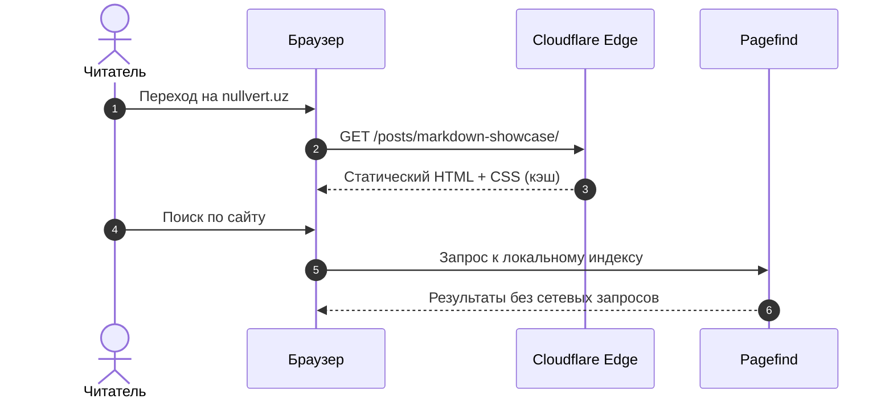

Полный обзор инструментов разметки в Shirone. От стандартного Markdown до эксклюзивных расширений темы — всё, что нужно для красивых и информативных постов.

<!-- more -->

---

## 1. Форматирование текста и акценты

**Базовые стили:**

- **Полужирное начертание** (`**bold**`)
- *Курсивное выделение* (`*italic*`)
- ***Полужирный курсив*** (`***bold italic***`)
- ~~Зачёркнутый текст~~ (`~~strikethrough~~`)
- `Встроенный код` (`` `inline code` ``)
- Индексы: H<sub>2</sub>O, 2<sup>10</sup> = 1024
- Скрытый ответ: :spoiler[**Astro** — победитель State of JS 2024 в категории «Фреймворки»]

**Маркеры выделения** (`==text==`) — Shirone поддерживает ==семантические маркеры== без лишнего HTML:

- ==Основной акцент темы (primary)=={.primary}
- ==Вторичный, ненавязчивый сигнал=={.secondary}
- ==Третичный редакторский акцент=={.tertiary}
- ==Ошибка или критическая ситуация=={.error}
- ==Практический совет читателю=={.tip}

**Аннотации к тексту** (`[+label]`) — Astro строит большинство страниц заранее, гидратируя только **интерактивные острова** [+islands] по требованию.

[+islands]:
  **Islands Architecture** — паттерн, при котором страница — это статичный HTML, а интерактивные компоненты (Svelte, React, Vue) гидратируются независимо. Это сводит к минимуму количество JS, отправляемого клиенту.

  Подробнее — [docs.astro.build/islands](https://docs.astro.build/en/concepts/islands/)

**Сноски** — блог работает на Astro[^1] с темой Shirone[^2].

[^1]: Astro — статический генератор с Islands Architecture, написанный на TypeScript.
[^2]: Shirone — M3E-совместимая тема для Astro с Svelte 5, Tailwind 4 и богатым набором Markdown-расширений.

---

## 2. Уведомления (Callouts)

> [!NOTE]
> **Информация:** Блог автоматически оптимизирует изображения в AVIF/WebP и генерирует поисковый индекс Pagefind.

> [!TIP]
> **Совет:** Используйте `:::collapse` для длинных пояснений — это сохраняет фокус читателя на главном.

> [!IMPORTANT]
> **Важно:** Все записи поддерживают Obsidian-совместимые вики-ссылки вида `[[slug|Заголовок]]`.

> [!WARNING]
> **Предупреждение:** Проверяйте актуальность версий пакетов в `package.json` перед сборкой.

> [!CAUTION]
> **Внимание:** Никогда не храните приватные API-ключи и токены в публичном репозитории!

---

## 3. Структурированный контент

**Шаги** (`:::steps`) — для пошаговых инструкций:

:::steps[Запуск Shirone-блога]
1. **Установить зависимости**

   Запустите менеджер пакетов из корня репозитория.

   ```powershell
   pnpm.cmd install
   ```

2. **Запустить dev-сервер**

   Сайт будет доступен на `localhost:4321`.

   ```powershell
   pnpm.cmd astro dev --port 4321
   ```

3. **Проверить типы и Astro**

   Убедитесь, что диагностика чиста перед публикацией.

   ```powershell
   npx.cmd astro check
   pnpm.cmd type-check
   ```

4. **Собрать продакшн-сборку**

   Генерирует статические страницы и поисковый индекс.

   ```powershell
   pnpm.cmd build
   ```
:::

**Раскрывающиеся панели** (`:::collapse`) — для FAQ и дополнительных деталей:

::: collapse accordion
- **Почему Astro, а не Next.js?**

  Astro генерирует ==чистый статический HTML=={.primary} без клиентского JavaScript по умолчанию. Это означает мгновенную загрузку и отличный SEO. Интерактивность добавляется точечно через острова.

- **Что такое M3E?**

  **Material 3 Extended** — дизайн-система Shirone, развивающая спецификацию Google Material 3. Использует динамические HCT-палитры, токены формы (`--shape-corner-*`) и токены движения (`--m3e-duration-*`).

- **Зачем нужен Pagefind?**

  Pagefind — это ==поиск на стороне клиента=={.secondary} без серверной части. Он строит индекс во время сборки и весит меньше 50 КБ. Подходит для статических сайтов с нулевым backend.
:::

---

## 4. Кодовая база (Expressive Code)

**TypeScript** — асинхронный клиент с повторными попытками:

```ts title="src/utils/fetchWithRetry.ts" {4-6} ins={14-16} del={11}
interface FetchOptions {
	retries?: number;
	backoffMs?: number;
}

export async function fetchWithRetry<T>(
	url: string,
	options: FetchOptions = {},
): Promise<T> {
	const { retries = 3, backoffMs = 500 } = options;
	// const res = await fetch(url);
	for (let attempt = 1; attempt <= retries; attempt++) {
		try {
			const response = await fetch(url);
			if (!response.ok) throw new Error(`HTTP ${response.status}`);
			return (await response.json()) as T;
		} catch (err) {
			if (attempt === retries) throw err;
			await new Promise((r) => setTimeout(r, backoffMs * attempt));
		}
	}
	throw new Error("Unexpected end of retries loop");
}
```

**Многоязычные вкладки** (`:::code-group`):

:::code-group
```go [Go Worker Pool]
package main

import (
	"fmt"
	"sync"
)

func worker(id int, jobs <-chan int, results chan<- int, wg *sync.WaitGroup) {
	defer wg.Done()
	for j := range jobs {
		results <- j * 2
		fmt.Printf("worker %d processed job %d\n", id, j)
	}
}
```
```rust [Rust Async Echo]
use tokio::net::TcpListener;
use tokio::io::{AsyncReadExt, AsyncWriteExt};

#[tokio::main]
async fn main() -> Result<(), Box<dyn std::error::Error>> {
    let listener = TcpListener::bind("127.0.0.1:8080").await?;
    loop {
        let (mut socket, _) = listener.accept().await?;
        tokio::spawn(async move {
            let mut buf = [0; 1024];
            while let Ok(n) = socket.read(&mut buf).await {
                if n == 0 { return; }
                let _ = socket.write_all(&buf[..n]).await;
            }
        });
    }
}
```
```python [Python PyTorch]
import torch
import torch.nn as nn

class ConvNet(nn.Module):
    def __init__(self):
        super().__init__()
        self.features = nn.Sequential(
            nn.Conv2d(3, 32, kernel_size=3, padding=1),
            nn.ReLU(),
            nn.MaxPool2d(2, 2)
        )
        self.fc = nn.Linear(32 * 16 * 16, 10)

    def forward(self, x):
        x = self.features(x)
        return self.fc(x.view(x.size(0), -1))
```
:::

**Интерактивное дерево кода** (`:::code-tree`) — IDE-подобная навигация по файлам:

:::code-tree{title="Shirone M3E — пример атома" height="320px" entry="src/Button.svelte"}
```svelte title="src/Button.svelte"
<script lang="ts">
  let { label = "Нажмите", variant = "filled" } = $props();
</script>

<button class="m3-btn m3-btn--{variant}">{label}</button>
```

```stylus title="src/styles/button.styl"
.m3-btn
  background: var(--primary)
  color: var(--on-primary)
  border-radius: var(--shape-corner-full)
  padding: 0 var(--m3e-space-4)
  font: var(--m3e-type-label-large)
  transition: box-shadow var(--m3e-duration-short) var(--m3e-easing-standard)
```

```json title="package.json"
{
  "name": "button-demo",
  "version": "1.0.0",
  "dependencies": {
    "shirones": "^0.1.5"
  }
}
```
:::

---

## 5. Файловые деревья

**Структура проекта** (`:::file-tree`) — с диффами `++/--` и комментариями:

:::file-tree{title="nullvert.uz — структура блога"}
- shirones/
  - config/
    - **siteConfig.ts** # главная конфигурация сайта
    - profileConfig.ts
    - musicConfig.ts
  - content/
    - posts/
      - markdown-showcase/
        - ++ index.md # этот пост
        - keyboard.webp
    - spec/
      - credits-and-licenses.md
- src/
  - components/
    - organisms/
      - Footer.astro
  - pages/
    - credits-and-licenses.astro
- public/
  - assets/
    - images/
    - music/
- package.json
:::

**Из терминала** (`` ```file-tree ``):

```file-tree title="dist/" icon="simple"
dist
├── _astro/
│   ├── index.css
│   └── client.js
├── posts/
│   └── markdown-showcase/
│       └── index.html
├── sitemap-index.xml
└── pagefind/
    └── pagefind.js
```

---

## 6. Формулы и математика (KaTeX)

Уравнение Шрёдингера:
$$i\hbar \frac{\partial}{\partial t}\Psi(\mathbf{r},t) = \left [ -\frac{\hbar^2}{2m}\nabla^2 + V(\mathbf{r},t) \right ] \Psi(\mathbf{r},t)$$

Формула Байеса:
$$P(A|B) = \frac{P(B|A) \cdot P(A)}{P(B)}$$

Реакция термоядерного синтеза:
$$\ce{^2_1H + ^3_1H -> ^4_2He + ^1_0n + 17.6 MeV}$$

---

## 7. Диаграммы (Mermaid)



---

## 8. Интеграция с GitHub

Репозиторий фреймворка, на котором работает блог:

::github{repo="withastro/astro"}

Компонентный движок интерфейса:

::github{repo="sveltejs/svelte"}

---

## 9. Изображения

Одиночное изображение с подписью:

")

Сетка изображений (`[grid]`):

[grid]


[/grid]

---

## 10. Таблица возможностей

| Категория | Расширение | Синтаксис | Гидратация JS |
| :--- | :--- | :--- | :---: |
| **Структура** | File Tree | `:::file-tree` | Нет |
| **Структура** | Code Tree | `:::code-tree` | Нет |
| **Навигация** | Steps | `:::steps` | Нет |
| **UX** | Collapse | `:::collapse` | Нет |
| **Акценты** | Marker | `==text==` | Нет |
| **UX** | Spoiler | `:spoiler[text]` | Минимальная |
| **Пояснения** | Annotations | `[+label]` | Нет |
| **Диаграммы** | Mermaid | `` ```mermaid `` | Нет |
| **Формулы** | KaTeX | `$$...$$` | Нет |
| **Виджеты** | GitHub Card | `::github{repo}` | Ленивая |

*Все расширения рендерятся в семантический HTML во время сборки и следуют токенам M3E.*